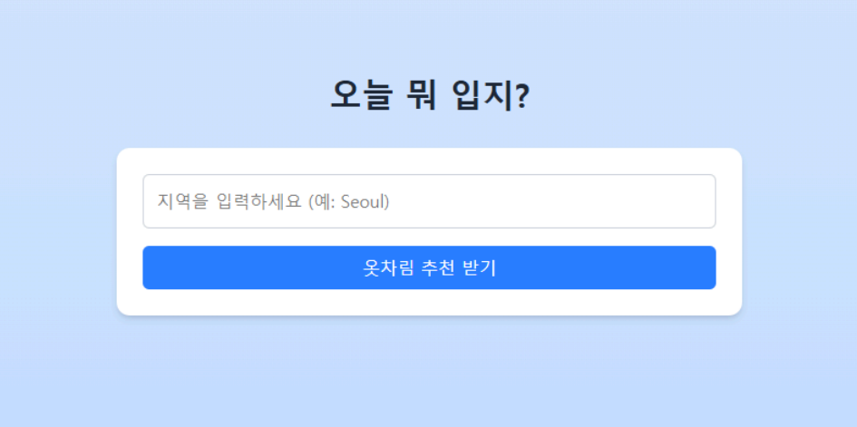
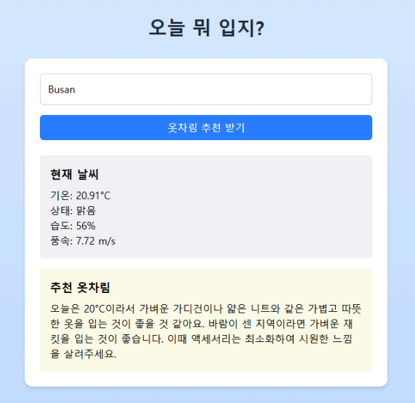
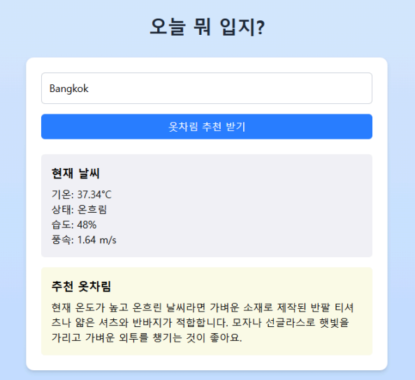
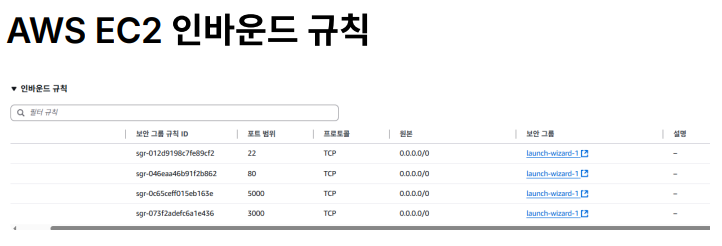
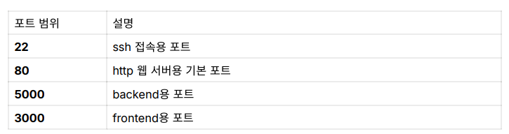
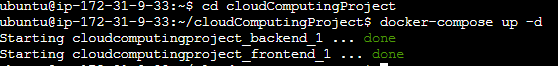

<p align="center">
    
</p>

# 프로젝트명
`검색 지역별 날씨 기반 의상 추천 서비스`
> 2025년 1학기 부산대학교 클라우드컴퓨팅 059분반 팀2 프로젝트 코드  
> 2025, first semester, Pusan National University Cloud Computing 059 and Team 2 Project Code

# 목차
- [프로젝트 멤버 이름 및 멤버 별 담당한 파트 소개](#프로젝트-멤버-이름-및-멤버-별-담당한-파트-소개)
- [프로젝트 소개](#프로젝트-소개)
- [프로젝트 필요성 소개](#프로젝트-필요성-소개)
- [관련 기술/논문/프로젝트 특허 조사 내용 소개](#관련-기술논문프로젝트-특허-조사-내용-소개)
- [프로젝트 개발 결과물 소개](#프로젝트-개발-결과물-소개)
- [개발 결과물을 사용하는 방법 소개](#개발-결과물을-사용하는-방법-소개)
- [개발 결과물의 활용방안 소개](#개발-결과물의-활용방안-소개)
- [기술스택](#기술스택)

---

## 프로젝트 멤버 이름 및 멤버 별 담당한 파트 소개
<div align="center">

<table>
  <thead>
    <tr>
      <th align="center">역할</th>
      <th align="center">이름</th>
      <th align="center">GitHub 프로필</th>
      <th align="center">Email</th>
    </tr>
  </thead>
  <tbody>
    <tr>
      <td align="center">BackEnd</td>
      <td align="center">강태진</td>
      <td align="center">
        <br>
        <a href="https://github.com/mireutale">@mireutale</a>
      </td>
      <td align="center">xowls0319@pusan.ac.kr</td>
    </tr>
    <tr>
      <td align="center">FrontEnd</td>
      <td align="center">daulet</td>
      <td align="center">
        <br>
        <a href="https://github.com/suyenish">@suyenish</a>
      </td>
      <td align="center">daulet2001@pusan.ac.kr</td>
    </tr>
    <tr>
      <td align="center">Deployment (배포)</td>
      <td align="center">윤민혁</td>
      <td align="center">
        <br>
        <a href="https://github.com/YoonMinHyuk">@YoonMinHyuk</a>
      </td>
      <td align="center">ghini7170@naver.com</td>
    </tr>
    <tr>
      <td align="center">Announcement (발표)</td>
      <td align="center">김진영</td>
      <td align="center">
        <br>
        <a href="https://github.com/jykimine">@jykimine</a>
      </td>
      <td align="center">jin41333@naver.com</td>
    </tr>
  </tbody>
</table>

</div>

---
## 프로젝트 소개

- 사용자가 선택한 지역의 날씨 정보를 OpenWeather API를 사용하여 실시간으로 가져와, 해당 날씨에 적합한 의상을 OpenAI GPT API를 통해 자연어로 추천을 받아 보여주는 웹 서비스입니다.
- 사용자는 별도의 로그인 없이 웹 페이지에 접속하여 즉시 옷차림 추천을 확인할
수 있게 하여, 사용자 접근성을 향상시킵니다. 
- 서비스는 단순한 날씨 제공을 넘어, 사용자 맞춤형 옷차림 정보를 제공함으로써 사용자의 편의성을 높이는 것을 목표로 합니다.

---
## 프로젝트 필요성 소개

기후 변화로 인해 계절에 따른 온도 변화가 예측하기 어려워졌습니다.  
이에 따라 옷차림을 결정하는 데 어려움을 겪는 사람이 많습니다.  
옷차림을 결정하기 위해서는 사용자의 지역을 토대로 날씨를 검색하고, 검색 결과에서 기상상태, 온도, 습도, 풍량 등을 종합적으로 고려해야 합니다.  
현대인의 바쁜 일상 속에서 다양한 날씨 요소를 종합적으로 고려해 적절한 옷차림을 결정하는 일은 번거롭고 어려운 일이 되었습니다.  
이러한 문제를 해결하기 위해 날씨 기반 의상 추천 서비스를 개발하고자 합니다.  

---
## 관련 기술/논문/프로젝트 특허 조사 내용 소개
- OpenWeatherMap API  
  - One Call API3.0 은 현재 날씨(current, minitely, hourly, daily 별 날씨 정
보), timestamp 기반 날씨 정보, 날씨 집계 정보, 날씨 개요 등을 지원한다.  
    - https://openweathermap.org/api/one-call-3

  - Geocoding API의 Coordinates by location name API는 도시의 이름을 기반으로 위도, 경도 정보를 반환한다.
    - https://openweathermap.org/api/geocoding-api

- OpenAI GPT API
  ① Python OpenAI 라이브러리를 활용해서 OpenAI GPT API를 편리하게 사
용할 수 있다.
  - OpenAI(최상위 API 클라이언트 클래스) 
  - chat(chat 관련 API 기능을 담당하는 서브모듈)  
  - completions 객체의 create 메서드를 사용하여, 프롬프트(입력 텍스트)를 기반으로 다양한 유형의 자연어 응답을 생성할 수 있다.
    - https://platform.openai.com/docs/guides/text?api-mode=chat
---
## 프로젝트 개발 결과물 소개

- 추천 옷차림을 알고싶은 지역을 검색하면, 현재 해당 지역의 날씨와 함께 추천 옷차림을 제공하는 서비스

- 기본화면
<p align="center">
    
</p>

- 예시 입력화면1 (ex, Busan)
<p align="center">
    
</p>

- 예시 입력화면2 (ex, Bangkok)
<p align="center">
    
</p>

---
## 개발 결과물을 사용하는 방법 소개

### 1. Amazon EC2 (Elastic Compute Cloud) 사용

- EC2 가상 머신을 실행시키고, 관련 인바운드 규칙을 아래와 같이 설정
<p align="center">
    
    
</p>

### 2. OS별 설정

#### window
  1. PowerShell을 관리자 권한으로 실행 후 명령어 입력
  ```
  wsl --install
  ```
  3. [Docker Desktop](https://www.docker.com/products/docker-desktop/) 설치
  4. Docker Desktop 실행 -> WSL2 백엔드 설정 확인
  5. WSL2 내부로 이동 후 명령어 입력
  ```
  sudo apt update
  sudo apt install git
  git clone https://github.com/Mireutale/cloudComputingProject.git
  ```
  6. Docker Compose 실행
  ```
  //폴더 내부로 이동
  cd cloudComputingProject
  docker compose up -d
  ```

#### Linux
  1. Docker 설치
  ```
  sudo apt update
  sudo apt install docker.io
  sudo systemctl enable --now docker
  ```
  2. Docker Compose 플러그인 설치
  ```
  sudo apt install docker-compose-plugin
  ```
  3. 설치 확인
  ```
  docker compose version
  ```
  4. 터미널에서 아래 명령어 입력
  ```
  sudo apt update
  sudo apt install git
  git clone https://github.com/Mireutale/cloudComputingProject.git
  ```
  5. Docker Compose 실행
  ```
  cd cloudComputingProject
  docker compose up -d
  ```

#### 서버 실행 모습
<p align="center">
    
</p>

---
## 개발 결과물의 활용방안 소개

- 날씨 앱에 통합하여, 현재 날씨와 함께 사용자에게 적절한 옷차림을 이미지 또는 텍스트로 추천
- IoT 스마트 거울에 적용해, 아침마다 사용자 위치의 날씨와 옷차림을 자동 표시
- 패션 쇼핑몰 연동으로, 날씨 기반 추천 의류 아이템을 자동 큐레이션하여 제안
- SNS 콘텐츠 자동 생성 도구로 사용해, 지역별 "오늘 뭐 입지?" 콘텐츠를 자동 게시
---
## 기술스택
- 
    - 
    - 
    - 
    - 
- 
    - 
    - 
    - 
    - 
- 
